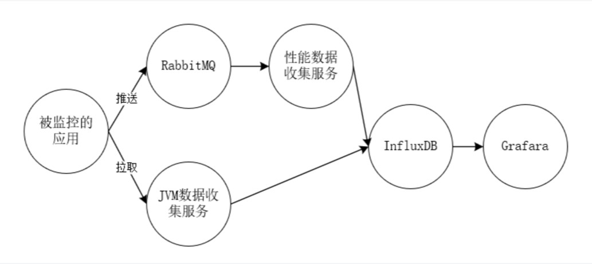
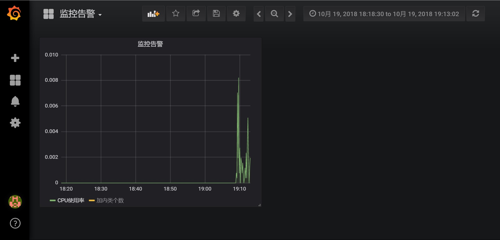

# 监控中间件

## 1,架构图

如下是整体架构图:




## 2,引入说明

spring boot项目引入jar包:

```
	<dependency>
			<artifactId>monitor</artifactId>
			<groupId>com.rpc.rpcx</groupId>
			<version>1.0.1</version>
		</dependency>
```

需额外添加相关配置

spring业务系统添加:

```
<bean id="metricsTimer" class="monitor.metrics.MetricsTimer">
		<property name="rabbitTemplate" ref="rabbitTemplate"/>
		<property name="topic" value="monitor"/>	
</bean>
```


## 3,业绩展示

## 


